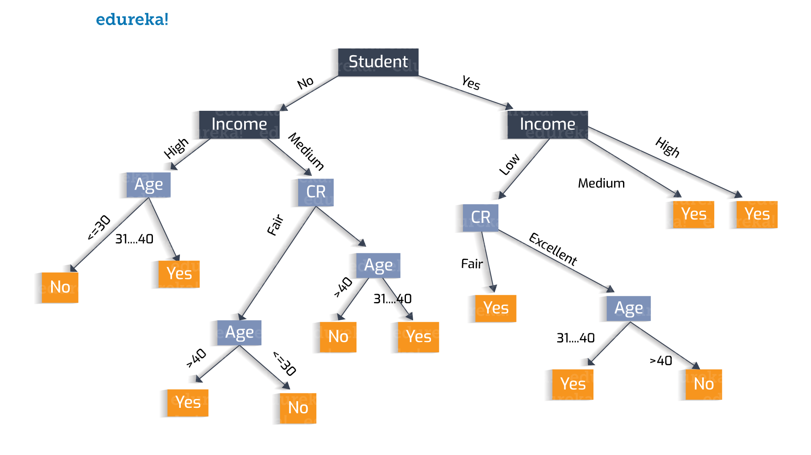

# Decision Tree

in __d3__ we have a Tree for decisions like below:

- # well-known methods is:
    - ## [id3](https://en.wikipedia.org/wiki/ID3_algorithm)
    - ## [C4.5](https://en.wikipedia.org/wiki/C4.5_algorithm)

in each __level__ we need to determine to select which attribute. 
for do this job we need to define some concept:
 - [Entropy](http://wiki.bethanycrane.com/entropy-in-ml) : -&Sigma;i=1N Pi log2Pi
 - [Information Gain]() : `IG(S)` = Entropy(S) - &Sigma;i=1 (Si&#247;S) &#215; Entropy(Si)
 - Gain-Ratio
 - Gini-Index

for determine attribute in certain level, calc `IG` for remain attrs and select maximum `IG` and continue this recursive

#### in [ID-3]() we use of information gain
#### in [C4.5]() we use Gain-Ratio and Gini-Index
